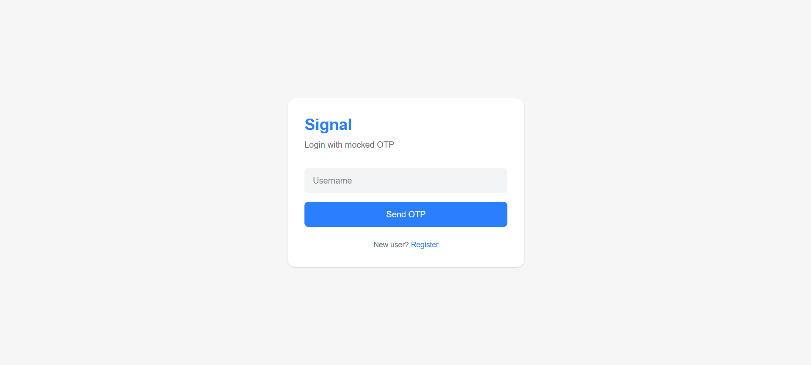
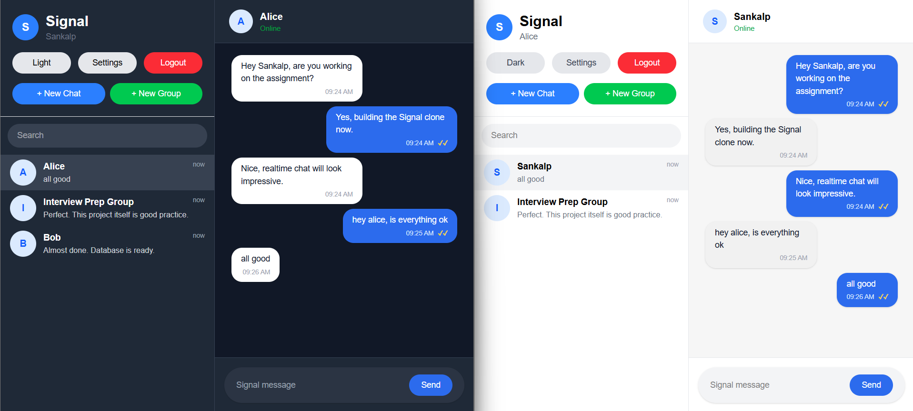
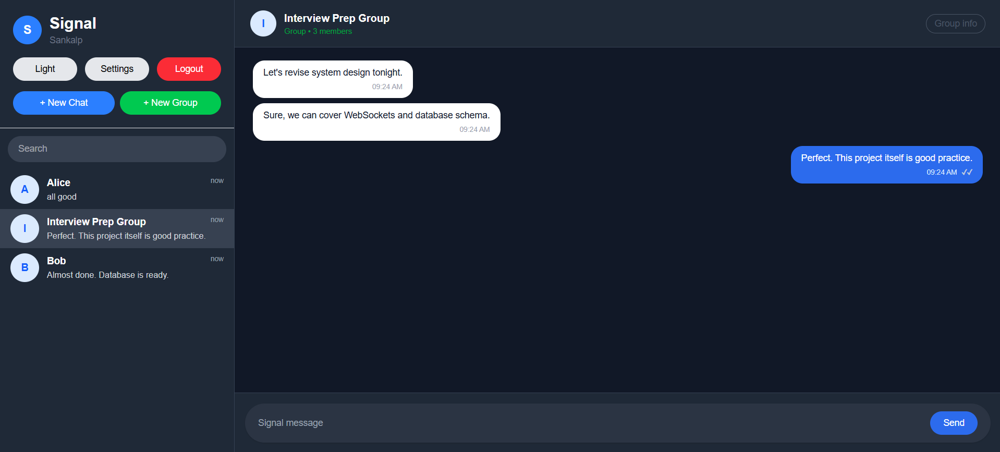
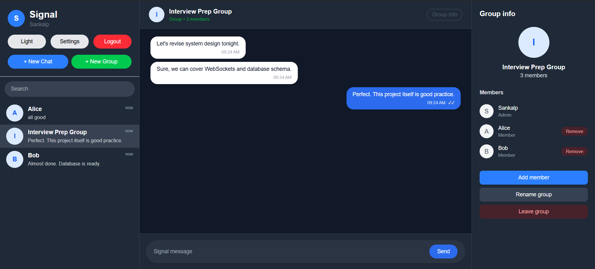

# Signal Clone

A full-stack clone of the Signal messaging application built using **Next.js**, **FastAPI**, **SQLite**, and **WebSockets**. The application recreates Signal's clean interface and core messaging experience with real-time one-to-one and group conversations.

---

## Screenshots

| Login |
|-------|
|  |

| Direct Chat | Group Chat |
|-------------|------------|
|  |  |

| Group Info |
|------------|
|  |

## Live Demo

**Frontend:** https://signal-clone-flame.vercel.app/

**Backend:** https://signal-clone-nzop.onrender.com

---

## GitHub Repository

https://github.com/Sankalp-Sinha/signal-clone

---

## Features

### Authentication

* User registration
* Login / Logout
* Session persistence
* Mock authentication
* User profile with avatar and display name

---

### Contacts & Conversations

* Create direct conversations
* Search conversations
* Create group chats
* Conversation list sorted by latest activity
* Last message preview
* Unread message indicators
* Mock online status

---

### Real-time Messaging

* Real-time messaging using WebSockets
* Message timestamps
* Typing indicators
* Delivery status
* Read receipts
* Persistent message storage

---

### Group Chats

* Create groups
* View members
* Add members
* Remove members
* Admin-only member management
* Group information panel

---

### User Experience

* Signal-inspired interface
* Dark / Light mode
* Toast notifications
* Search functionality
* Responsive desktop layout
* Settings placeholders
* Privacy placeholders

---

## Tech Stack

### Frontend

* Next.js (TypeScript)
* Tailwind CSS
* React
* react-hot-toast

### Backend

* FastAPI
* SQLAlchemy
* SQLite
* Pydantic
* Uvicorn

### Real-time

* Native WebSockets

---

## Project Structure

```
signal-clone/

├── frontend/
│   ├── app/
│   ├── components/
│   ├── lib/
│   └── public/
│
├── backend/
│   ├── routers/
│   ├── schemas/
│   ├── services/
│   ├── models.py
│   ├── database.py
│   ├── main.py
│   ├── seed.py
│   └── signal.db
│
└── README.md
```

---

# Architecture Overview

```
                 Next.js Frontend
                        │
        REST APIs       │       WebSockets
                        │
                  FastAPI Backend
                        │
                  SQLAlchemy ORM
                        │
                    SQLite Database
```

---

# Database Schema

## User

| Field        | Type     |
| ------------ | -------- |
| id           | Integer  |
| username     | String   |
| display_name | String   |
| avatar_url   | String   |
| phone        | String   |
| is_online    | Boolean  |
| last_seen    | DateTime |

---

## Conversation

| Field      | Type           |
| ---------- | -------------- |
| id         | Integer        |
| type       | direct / group |
| name       | String         |
| avatar_url | String         |
| created_at | DateTime       |

---

## ConversationMember

| Field           | Type         |
| --------------- | ------------ |
| id              | Integer      |
| conversation_id | FK           |
| user_id         | FK           |
| role            | admin/member |
| unread_count    | Integer      |

---

## Message

| Field           | Type                       |
| --------------- | -------------------------- |
| id              | Integer                    |
| conversation_id | FK                         |
| sender_id       | FK                         |
| content         | String                     |
| status          | sending / delivered / read |
| is_read         | Boolean                    |
| created_at      | DateTime                   |

---

# API Overview

## Authentication

```
POST /auth/register
POST /auth/login
```

---

## Conversations

```
GET    /conversations
POST   /conversations/direct
POST   /conversations/group
POST   /conversations/{id}/read
GET    /conversations/{id}/members
POST   /conversations/{id}/members
DELETE /conversations/{id}/members/{user_id}
```

---

## Messages

```
GET  /messages/{conversation_id}
POST /messages/send
POST /messages/{conversation_id}/typing
POST /messages/{conversation_id}/read
```

---

## WebSocket

```
ws://.../ws/{conversation_id}
```

Used for:

* Real-time messaging
* Typing indicators
* Live message updates

---

# Local Setup

## Clone Repository

```bash
git clone https://github.com/YOUR-USERNAME/signal-clone.git

cd signal-clone
```

---

## Backend

```bash
cd backend

python -m venv venv

# Windows
venv\Scripts\activate

pip install -r requirements.txt

python seed.py

uvicorn main:app --reload
```

Backend runs on:

```
http://localhost:8000
```

---

## Frontend

```bash
cd frontend

npm install

npm run dev
```

Frontend runs on:

```
http://localhost:3000
```

---

# Environment Variables

## Frontend

Create a `.env.local`

```
NEXT_PUBLIC_API_URL=http://localhost:8000

NEXT_PUBLIC_WS_URL=ws://localhost:8000
```

---

## Production

```
NEXT_PUBLIC_API_URL=<YOUR_RENDER_URL>

NEXT_PUBLIC_WS_URL=wss://<YOUR_RENDER_URL_WITHOUT_https>
```

---

# Assumptions

* Authentication is mocked.
* OTP verification is simulated.
* End-to-end encryption is mocked.
* Online presence is simulated.
* SQLite is used as the project database.
* Voice calls, Stories, and Linked Devices are placeholders as specified in the assignment.

---

# Future Improvements

* File attachments
* Emoji reactions
* Reply to messages
* Voice & Video calls
* Push notifications
* End-to-end encryption
* Mobile-first responsive design

---

# Author

**Sankalp Kumar Sinha**

IIIT Bhagalpur

B.Tech Computer Science & Engineering
